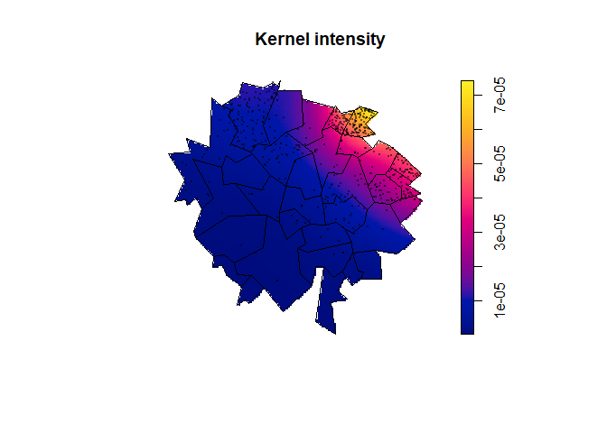
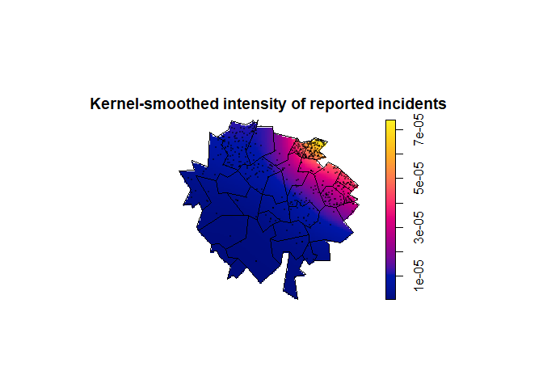
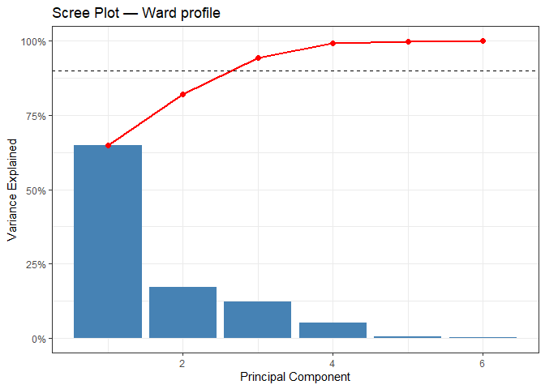

# Coursework 2


<!--- DO NOT DELETE THIS LINE --->

<!--- METADATA ANCHOR: MA22019-CW2-2026 --->

# Data Preparation Notes

<!--- DO NOT DELETE THIS LINE - DATA PREPARATION NOTES ANCHOR --->

Briefly document the main data-handling decisions that matter for your
analysis. This section may be short prose or one small table.

``` r
library(tidyverse)
library(sf)
library(knitr)

wards <- read_sf("data/city_wards.shp")
profiles <- read_csv("data/ward_profiles.csv" , show_col_types = FALSE)
incidents <- read_csv("data/incident_reports.csv" , show_col_types = FALSE)

#NAs in datasets
na_summary <- tibble(dataset = c("incidents", "ward profiles", "ward polygons"),
  missing_values = c(sum(is.na(incidents)),sum(is.na(profiles)),sum(is.na(wards))))
  
#profiles cleaning 
profiles_clean <- profiles %>%
  mutate(rental_share = parse_number(rental_share),
         ward_name = str_replace_all(ward_name, "-" , " "))
```

I loaded the ward boundary polygons, ward profile data and incident
reports. The incident and ward polygon files had no missing values,
while the ward profile file had 6 missing values; these were retained
and handled using available cases where relevant. I converted
rental_share from percentage text to a numeric variable. I also
standardized ward names in the profile file by replacing hyphens with
spaces, although later joins use ward_id rather than ward_name to avoid
relying on name formatting.

# Task 1

<!--- DO NOT DELETE THIS LINE - TASK 1 ANCHOR --->

Identify and investigate the most important spatial patterns in the
incident data.

``` r
library(spatstat)

#conversion and check in spatial
incidents_sf <- incidents %>% 
  st_as_sf( coords = c("x","y"), crs = st_crs(wards) )

#creating recorded and spatial wards left join
incidents_joined <- incidents_sf %>%
  st_join( wards %>% select(ward_id , ward_name) , left = TRUE ) %>% 
  rename( ward_name_recorded = ward_name.x , ward_name_spatial = ward_name.y)

#number of rows where recorded and spatial dont match
discrepancies <- incidents_joined %>% 
  st_drop_geometry() %>% 
  filter(ward_name_recorded != ward_name_spatial) %>% 
  nrow()

#number of incidents in each spatial ward
incident_counts <-  incidents_joined %>% 
  st_drop_geometry() %>%
  count(ward_id, ward_name_spatial, name = "n_incidents")

wards_incident <- wards %>% 
  left_join(incident_counts %>% select(ward_id, n_incidents),by = "ward_id") %>%
  mutate(n_incidents = replace_na(n_incidents, 0),
         area_m2 = as.numeric(st_area(geometry)),
         incident_density =  n_incidents / area_m2)

#kernel-smoothed intensity for ppp
wards_window <- as.owin(st_union(wards))
incident_coords = st_coordinates(incidents_sf)
incident_ppp <-  ppp( x = incident_coords[,1] , y =incident_coords[,2] , window = wards_window)

incident_intensity <-  density.ppp( x = incident_ppp , edge= TRUE)

plot(incident_intensity,main = "")
title("Kernel intensity", line = 1.5)
plot(st_geometry(wards),add = TRUE,lwd = 0.5)
plot(incident_ppp, add = TRUE, pch = 16,cex = 0.25)
```



``` r
#choropleth map 
ggplot(wards_incident) +
  geom_sf(aes(fill = incident_density), colour = "white", linewidth = 0.2) +
  scale_fill_viridis_c() +
  labs(title = "Incident density by ward",fill = "Incidents\nper m²") +
  theme_minimal()
```



``` r
top_wards <- wards_incident %>% 
  st_drop_geometry() %>% 
  arrange(desc(n_incidents)) %>% 
  select(ward_id,ward_name, n_incidents, incident_density) %>% 
  slice_head(n=5)

total_incidents = sum(wards_incident$n_incidents)

top_10_share <- wards_incident %>%
  st_drop_geometry() %>% 
  arrange(desc(n_incidents)) %>% 
  slice_head(n =10) %>% 
  summarise( share = (sum(n_incidents)/total_incidents) *100)

top_5_share <-  wards_incident %>% 
  st_drop_geometry() %>% 
  arrange(desc(n_incidents)) %>% 
  slice_head(n=5) %>% 
  summarise ( share = (sum(n_incidents)/total_incidents)*100)
```

I converted the incident coordinates into an sf point layer using the
same CRS as the ward polygons, then spatially joined each incident to
the ward polygon containing it. This was preferred to relying only on
the recorded ward name because 39 incidents had a recorded ward name
that differed from the coordinate-based ward assignment. Subsequent ward
counts therefore use the spatially assigned ward, so the analysis
reflects the actual incident locations.

The incident records were first treated as point pattern data, since
each row records an event location. The kernel-smoothed intensity map
shows a clear non-homogeneous pattern, with the highest intensity in the
north-east/eastern region and much lower intensity across the south-west
and outer areas.

I then aggregated incidents to wards to produce a lattice summary of the
same pattern. The ward choropleth confirms that the highest incident
densities are concentrated in the same north-east/eastern part of the
city. Since density was calculated using ward area in square metres, the
values are small, but the relative pattern is still clear.

Maple Cross had the highest count, with 337 incidents and the highest
ward density, followed by Saffron Lea with 110 incidents. Market End,
Hazel Row and Foxley also had high counts, with 96, 95 and 57 incidents
respectively.

The top five wards accounted for 70.4% of incidents and the top ten for
86.4%, confirming that incidents are concentrated in a small number of
wards rather than evenly distributed across the city.

# Task 2

<!--- DO NOT DELETE THIS LINE - TASK 2 ANCHOR --->

Use the available neighbourhood data to develop and justify possible
explanations for the patterns you identified.

``` r
wards_data = wards_incident %>% 
  left_join(profiles_clean %>% select(-ward_name) , by = "ward_id")

#PCA of profiles 

#not keeping transport access and listed building shares because they have NA values 
PCA_profile_data <- wards_data %>% 
  st_drop_geometry() %>% 
  select(unemployment_rate,
         deprivation_score,
         rental_share,
         population_density,
         lighting_coverage,
         distance_police_hub)

profile_pca <- prcomp(PCA_profile_data, scale. = TRUE)

var_explained <- profile_pca$sdev^2 / sum(profile_pca$sdev^2)

library(patchwork)

loadings <- data.frame(
    variable = rownames(profile_pca$rotation),
    PC1 = profile_pca$rotation[, 1],
    PC2 = profile_pca$rotation[, 2])

pca_score <- data.frame( ward_id = wards_data$ward_id,
                         PC1 = profile_pca$x[,1],
                         PC2 = profile_pca$x[,2])
wards_data_pca <- wards_data %>% 
  left_join( pca_score , by ="ward_id")

pc1_map <- ggplot(wards_data_pca) +
  geom_sf(aes(fill = PC1), colour = "white", linewidth = 0.2) +
  scale_fill_viridis_c() +
  labs(fill = "PC1 score") +
  theme_minimal()

pc2_map <- ggplot(wards_data_pca) +
  geom_sf(aes(fill = PC2), colour = "white" ,linewidth = 0.2) +
  scale_fill_viridis_c() +
  labs(fill = "PC2 score") +
  theme_minimal()

(pc1_map + pc2_map) + 
  plot_annotation(title = "PC1 and PC2 scores by ward", 
                  theme = theme(plot.title = element_text(hjust = 0.5, face = "bold")))
```



``` r
cor_pc1 <- cor(wards_data_pca$incident_density , wards_data_pca$PC1, use = "complete.obs")
cor_pc2 <- cor(wards_data_pca$incident_density, wards_data_pca$PC2, use = "complete.obs")
```

I used PCA to summarise the neighbourhood profile variables. I excluded
transport_access and listed_building_share from the PCA because they
contained missing values (this avoided dropping any wards from the PCA).
The variables were standardised before PCA.

PC1 explained 64.9% of the variation in the selected ward-profile
variables, and PC1 and PC2 together explained 82.1%.

The PC1 loadings were positive for unemployment rate, deprivation score,
rental share and distance from the police hub, and negative for lighting
coverage. I therefore interpret PC1 as a broad social-pressure and
weaker-safety-infrastructure component. PC2 was dominated by a large
negative loading for population density,so lower PC2 scores represent
higher-density wards.

The spatial maps of PC1 and PC2 scores partly align with the incident
pattern from Task 1. High PC1 scores occur across the northern part of
the city, while low PC2 scores, corresponding to higher population
density (because PC2 had a large negative population-density loading)
are more evident towards the east. This is consistent with the
north-east/eastern incident hotspot being associated with both social
pressure and density.

However, the associations with incident density are only moderate:
r=0.420 for PC1 and r=-0.391 for PC2 (where r is the correlation
coefficient). Therefore, the ward-profile variables provide partial
support for the hotspot explanation, but they do not fully explain the
sharp concentration of incidents.

# Task 3

<!--- DO NOT DELETE THIS LINE - TASK 3 ANCHOR --->

Make a small number of evidence-based recommendations for priority areas
or actions.

``` r
priority_wards <- wards_data_pca %>% 
  st_drop_geometry() %>% 
  mutate( profile_score = PC1-PC2) %>% 
  arrange(desc(incident_density)) %>% 
  select(ward_name , n_incidents , incident_density , PC1 , PC2 , profile_score,unemployment_rate, deprivation_score, rental_share, population_density, transport_access, lighting_coverage, distance_police_hub, listed_building_share  ) %>% 
  slice_head(n=2)

exemplary_wards <-  wards_data_pca %>% 
  st_drop_geometry() %>% 
  mutate( profile_score = PC1-PC2) %>% 
  arrange(desc(incident_density)) %>% 
  select(ward_name , n_incidents , incident_density , PC1 , PC2 , profile_score,unemployment_rate, deprivation_score, rental_share, population_density, transport_access, lighting_coverage, distance_police_hub, listed_building_share  ) %>% 
  slice_tail(n=2)

task3_table <- bind_rows(
  priority_wards %>% mutate(group = "Priority"),
  exemplary_wards %>% mutate(group = "Comparison")
) %>%
  select(
    group, ward_name, n_incidents, incident_density, profile_score,
    PC1, PC2, deprivation_score, unemployment_rate,
    lighting_coverage, distance_police_hub
  )

task3_table %>%
  mutate(
    incident_density = incident_density,
    profile_score = round(profile_score, 2),
    PC1 = round(PC1, 2),
    PC2 = round(PC2, 2),
    deprivation_score = round(deprivation_score, 1),
    unemployment_rate = round(unemployment_rate, 1),
    lighting_coverage = round(lighting_coverage, 1),
    distance_police_hub = round(distance_police_hub, 1)
  ) %>%
  kable(
    col.names = c(
      "Group", "Ward", "Incidents", "Incidents per m²", "Profile score",
      "PC1", "PC2", "Deprivation", "Unemployment", "Lighting", "Police distance"
    ),
    caption = "Priority and comparison wards based on incident burden and PCA neighbourhood-profile evidence."
  )
```

| Group | Ward | Incidents | Incidents per m² | Profile score | PC1 | PC2 | Deprivation | Unemployment | Lighting | Police distance |
|:---|:---|---:|---:|---:|---:|---:|---:|---:|---:|---:|
| Priority | Maple Cross | 337 | 0.0002229 | 3.90 | 3.08 | -0.81 | 83.5 | 15.8 | 58.1 | 5 |
| Priority | Saffron Lea | 110 | 0.0001119 | 2.56 | 1.21 | -1.35 | 61.1 | 12.1 | 65.4 | 4 |
| Comparison | Bracken Vale | 0 | 0.0000000 | -3.15 | -3.54 | -0.39 | 16.0 | 3.3 | 97.1 | 0 |
| Comparison | Canal Side | 0 | 0.0000000 | -2.20 | -2.94 | -0.73 | 23.2 | 3.6 | 96.4 | 1 |

Priority and comparison wards based on incident burden and PCA
neighbourhood-profile evidence.

The clearest priority areas are Maple Cross and Saffron Lea. Maple Cross
had 337 incidents and 0.0002229 incidents per m², while Saffron Lea had
110 incidents and 0.0001119 incidents per m². Both also had positive PCA
profile scores, while the comparison wards Bracken Vale and Canal Side
had no incidents and negative profile scores.

The PCA evidence suggests that the most relevant short-term actions are
linked to safety infrastructure rather than broad structural variables.
PC1 loaded positively on distance from the police hub and negatively on
lighting coverage, so higher PC1 scores partly reflect wards that are
further from police infrastructure and less well lit. Maple Cross had
police-hub distance 5 and lighting coverage 58.1, while Saffron Lea had
distance 4 and lighting coverage 65.4. In contrast, Bracken Vale and
Canal Side had police-hub distances 0 and 1 and lighting coverage 97.1
and 96.4.

The main recommendation is therefore to prioritise local police response
coverage in the Maple Cross/Saffron Lea hotspot, for example through
revised patrol routing or improved local reporting access. A second
recommendation is to review lighting coverage, especially in Maple
Cross.

Deprivation and unemployment support the case for prioritising these
wards, but they are longer-term structural issues rather than immediate
operational fixes. These recommendations are priorities for
investigation and intervention, not causal claims.

# References

<!--- DO NOT DELETE THIS LINE - REFERENCES ANCHOR --->

Add references only if needed.

    **Prose Word Count:** 839 words (161 words under the 1000-word limit)
